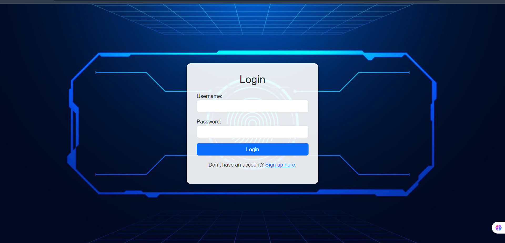
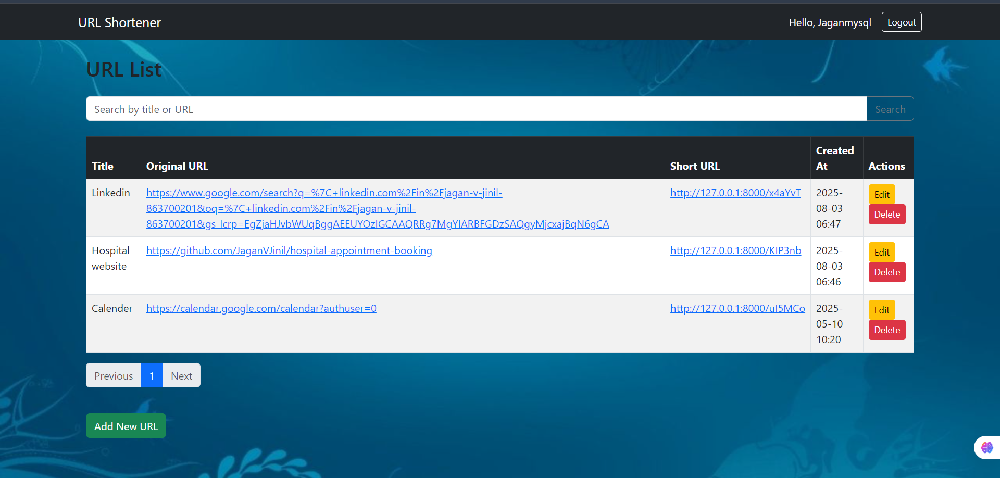
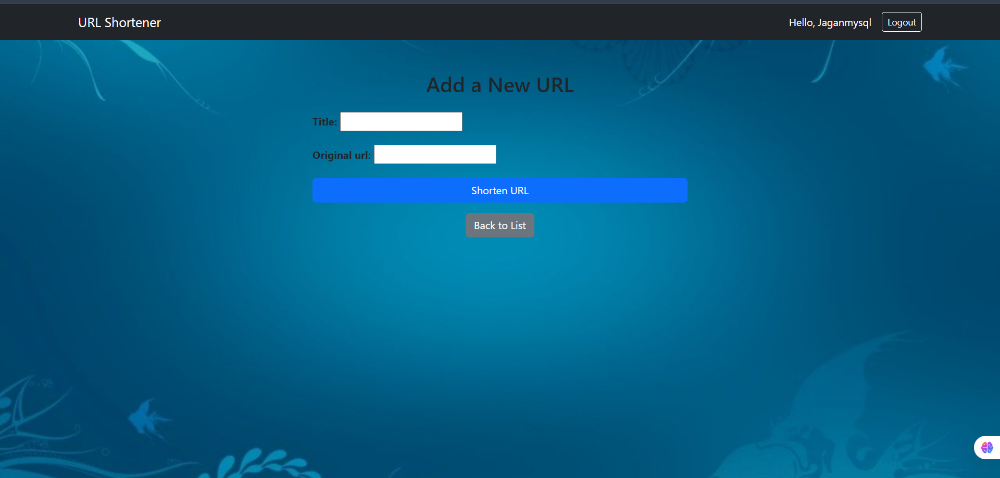
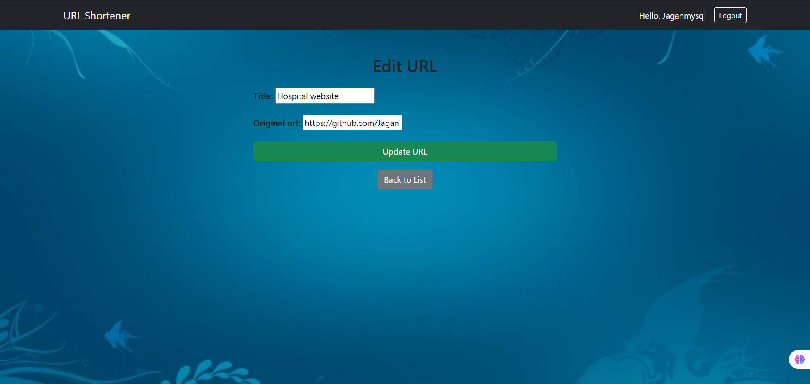

# 🔗 Django URL Shortener

A simple web application built with Django and MySQL that allows users to shorten URLs and manage them with authentication. Each user can create up to 5 URLs.

---

## 🚀 Features

- ✅ User Signup & Login
- ✅ Shorten long URLs automatically
- ✅ Limit of 5 URLs per user
- ✅ Edit and Delete URLs
- ✅ View list of all your shortened URLs
- ✅ Pagination for easy navigation

---

## My UI 

### 🔐 Login Page

### 📋 Urllist

### 📋 Add

### 📋 Edit

## 🛠️ Tech Stack

- **Backend:** Django
- **Database:** MySQL
- **Frontend:** Django Templates (HTML, CSS, Bootstrap)

## 🔄 Problem: Browser Back Button After Logout
After logging out, users could still view the previous pages using the browser's back button due to browser caching, which posed a security concern.

## ✅ Solution Implemented:
To fix this, I used Django’s @never_cache decorator on the login and logout views, which prevents cached content from being served after logout. This ensures the user session is completely terminated and protected from unauthorized access via browser navigation.

## 🚀  Significane of My website
**✅ Real-World Use Case: A personalized bookmarking tool with URL shortening is something users and developers can use daily to manage and quickly access important links.**

**🔒 User-Centric Security: Enforced authentication, limited bookmark count, and cache control to ensure data privacy.**

**⚙️ Full CRUD & Pagination: Supports creating, reading, updating, and deleting bookmarks with pagination and search for better usability.**

**🔗 Clean Short URLs: Generates user-friendly, production-ready short links like https://yourdomain.com/XiokqB.**

**📚 Full Stack Implementation: Combines backend logic (Django) with frontend interactivity (HTML/CSS/JS) using best practices in state management and routing.**

